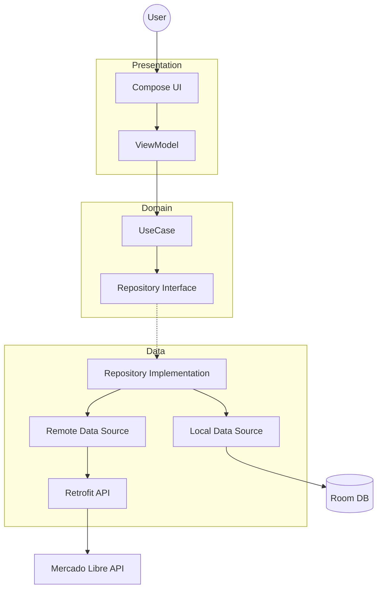

# MeliApp Architecture Documentation

## Overview
This application follows **Clean Architecture** principles combined with **MVVM (Model-View-ViewModel)** pattern and **Jetpack Compose** for the UI. The goal is to ensure separation of concerns, testability, and maintainability.

## Tech Stack
- **Language**: Kotlin
- **UI**: Jetpack Compose (Material 3)
- **Dependency Injection**: Hilt (Dagger)
- **Network**: Retrofit + OkHttp
- **Async**: Coroutines + Flow
- **Image Loading**: Coil
- **Serialization**: Moshi
- **Local Database**: Room

## Architecture Layers

### 1. Presentation Layer (`presentation/`)
- **UI**: Composable functions (`SearchScreen`, `ProductDetailScreen`) responsible for rendering the state.
- **ViewModel**: (`SearchViewModel`, `ProductDetailViewModel`) Holds the UI state (`StateFlow`), handles user interactions, and executes UseCases. It maps Domain models to UI state.

### 2. Domain Layer (`domain/`)
- **Entities**: Pure Kotlin data classes (`Product`, `ProductDetail`) independent of frameworks.
- **Use Cases**: Encapsulate specific business rules (`SearchProductsUseCase`, `GetProductDetailUseCase`). They are the entry point to the domain layer.
- **Repository Interfaces**: Define the contract for data access (`ProductRepository`).

### 3. Data Layer (`data/`)
- **DTOs**: Data Transfer Objects (`ItemDto`, `ItemDetailDto`) matching the API response structure.
- **Repository Implementation**: (`ProductRepositoryImpl`) Implements the domain interface. It orchestrates data fetching from data sources (Remote and Local) and maps DTOs to Domain entities.
- **Remote Data Source**: (`ProductRemoteDataSource`) Handles the raw network calls via Retrofit.
- **Local Data Source**: (`ProductLocalDataSource`) Handles database operations via Room.
- **API**: (`MercadoLibreApi`) Retrofit interface defining endpoints.

## Data Flow Diagram

## Error Handling Strategy

### Developer Perspective
- **Exceptions**: Network and HTTP errors are caught in the `DataSource` layer.
- **Caching**: Successful searches are cached in the Room database to provide offline capabilities.
- **Fallback**: If the network fails, the repository first checks the local cache. if both fail, it may degrade to use local **Mock Data** for demonstration purposes.

### User Perspective
- **Feedback**: The UI displays clear error messages or empty state indicators.
- **Non-blocking**: Loading states are shown using `CircularProgressIndicator`.
- **Resilience**: The mock fallback ensures the user can always see "something" (demo mode) even if the API token expires or the network fails, preventing a crash or blank screen.

## AI Usage
- **Tools**: Trae IDE (Gemini-3-Pro-Preview)
- **Role**: Pair programmer for refactoring, bug fixing, and UI enhancements.
- **Key Contributions**: 
    - Resolved Hilt dependency injection issues.
    - Implemented robust error handling and mock fallback.
    - Enhanced UI with Material Design 3 best practices.
